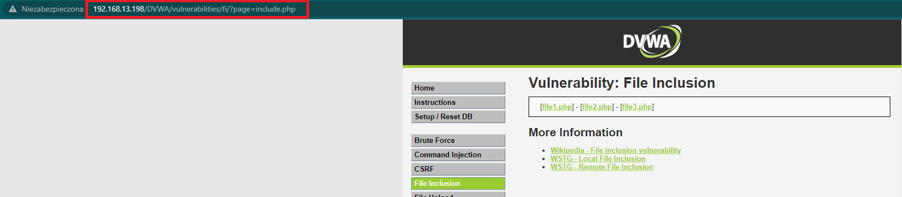
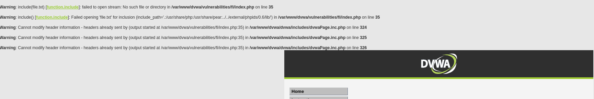

# Local File Inclusion- DVWA

## Jak połączyć się z DVWA?
- 192.168.1.1


## LFI- Low Security

- W linku znajduje się parametr odpowiadający za ładowanie strony internetowej, którym będziemy się posługiwali przez całe walkthorugh:

    ```
    192.168.X.X/dvwa/vulnerabilities/fi/?page=index.php
    ```



- Na poziomie **LOW** praktycznie nie ma żadnych zabezpieczeń, w związku z czym od razu możemy przejśc do ataku:

    1) Zmieniamy wartość parametru w URL z `index.php` w celu zobaczenia zachowania maszyny:
        ```
        http://192.168.X.X/dvwa/vulnerablity/fi/?page=file.txt
        ```
    
    2) Pojawiła nam się informacja zwrotna mówiąca o błędzie. Możemy z niej wyczytać w jakim folderze obecnie się znajdujemy. Ułatwia nam to przygotowanie payload'a, którym będzie wartość parametru `page`.
    

    3) W związku z tym, że znajdujemy się na ścieżce: `/var/www/dvwa/vulnerabilities/fi/index.php` jesteśmy w stanie policzyć, że ile folderów w zwyż powinniśmy przejśc, aby odczytać konkretne pliki. My się skupimy na pliku `/etc/passwd`:
        
    4) W związku z informacją jaką posiadamy tworzymy payloada. Przejdziemy 5 folderów do góry, aby znaleźć się w podstawowym z którego przejdziemy kolejno do `/etc`, a następnie odczytamy plik `passwd`. Paylaod wygląda następująco:
        ```sh
        ../../../../../etc/passwd
        ```

    5) Zmodyfikowany URL:
        ```
        http://192.168.X.X/dvwa/vulnerabilities/fi/?page=../../../../../etc/passwd
        ```
    
