# File Inclusion- Walkthrough

- Autor: [Mateusz Głuchowski](https://github.com/hue1337)

# Local File Inclusion- DVWA

## Jak połączyć się z DVWA?
1. Wpisujemy w przeglądarce link: http://192.168.13.198/DVWA/vulnerabilities/fi/?file=include.php.
2. Upewniamy się, że poziom trudności jest ustawiony na `LOW`:

    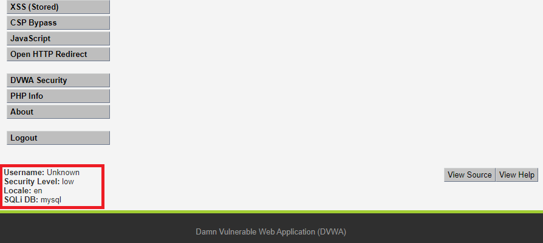

3. Jeżeli poziom trudności jest inny to zmieniamy go w zakładce `DVWA Security`:

    

4. Na koniec przechodzimy do zakładki `File Inclusion`:

    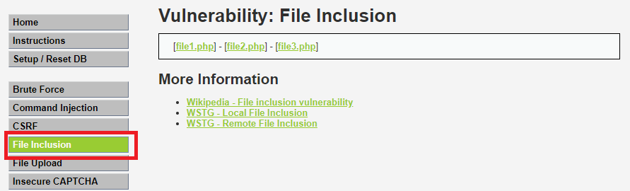

## Cheatsheet- Local File Inclusion
- Zanim przejdziemy do przeprowadzenia ataku warto wiedzieć, czego będziemy szukali na serwerze. Poniżej znajduję lista powszechnych plików systemowych, których możemy użyć podczas testowania aplikacji:

    

    _Źródło: https://tryhackme.com_


## LFI- Low Security

- Teraz możemy w pełni przejść do przeprowadzenia ataku `LFI`. W linku znajduje się parametr odpowiadający za ładowanie strony internetowej, którym będziemy się posługiwali przez całe walkthorugh:

    ```
    ?page=include.php
    ```
    


- Na poziomie **LOW** praktycznie nie ma zabezpieczeń, w związku z czym od razu możemy przejść do zabwy:

    1. Zmieniamy wartość parametru w URL z `index.php` w celu zobaczenia zachowania maszyny (zobaczanie potncjalnych informacji o błędzie np.: `... include(var/www/html/DVWA/.../file.txt) ... not found`):
        ```
        http://192.168.X.X/DVWA/vulnerablity/fi/?page=file.txt
        ```
    2. Niestety aplikacja nie podaje informacji zwrotnych, w związku z czym albo korzystamy z wiedzy własnej, albo pytamy o pomoc **WUJKA GOOGLE**. Serwisy postawione na systemów z rodziny UNIX najczęściej mają kody źródłowe umieszczone w folderze `var/www/html/`. W związku z czym analizujemy na czym stoimy:
        - Link wygląda następująco:
            ```
            http://192.168.X.X/DVWA/vulnerablities/fi/?page=include.php
            ```
        - Po adresie `IP` znajduje się ścieżka do pliku (strony), na której się znajdujemy:
            ```
            /DVWA/vulnerabilities/fi/?page=include.php
            ```
        - Wcześniej dowiedzieliśmy się, że aplikacja znajduję się (najprawdopodbniej) na ścieżce `var/www/html/`. Łącząc fakty dostajemy ścieżkę:
            ```
            var/www/html/DVWA/vulnerabilities/fi/
            ```
        - Na podstawie tego widzimy, że musimy przejść 6 folderów do góry, aby dostać się do folderu głównego. Zaczynamy tworzyć **PAYLOAD** wykorzystując `Directory Traversal`:
            ```
            ../../../../../../
            ```
        - Uznajmy, że naszą flagą będzie plik `/etc/passwd`, który wzięliśmy ze ściągawki. Rozbudowujemy **PAYLAODA**:
            ```
            ../../../../../../etc/passwd
            ```
    3. Stworzonego **PAYLOADA** podstawiamy jako parametr linku:
        ```
        http://192.168.X.X/DVWA/vulnerabilities/fi/?page=../../../../../../etc/passwd
        ```
        Po wyświetleniu się zawartości pliku `etc/passwd` wiemy, że nasz payload zadziałał: 
        
        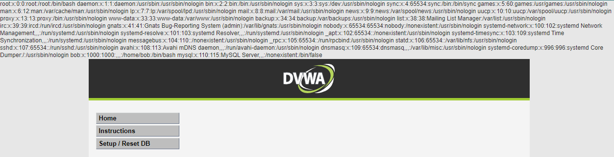

- Polecam spróbować stworzyć **PAYLOADY** w celu wyświetleniach zawartości innych plików z naszego **CHEATSHEETU**.

## LFI- Medium Security

- Zanim przejdziemy do ataku na poziomie **medium** musimy zmienić poziom trudności. Przechodzimy do zakładki `DVWA Security` i wprowadzamy poniższe zmiany:
    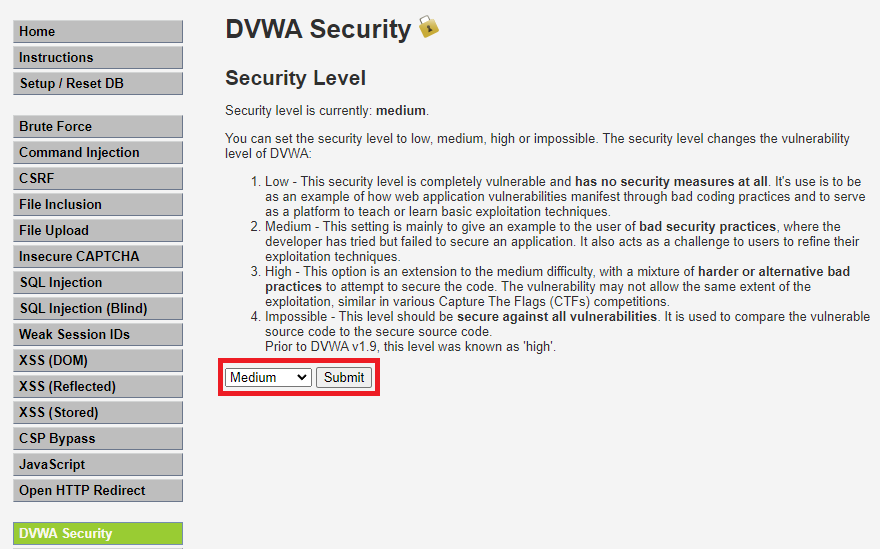
    

    1. Na poziomie `medium` występuje już podstawowa walidacja inputu, którą rozpoznamy poprzez metodę prób i błędów. Zaczynamy testowanie od **PAYLOADA** z poprzedniego poziomu trudności:
       
        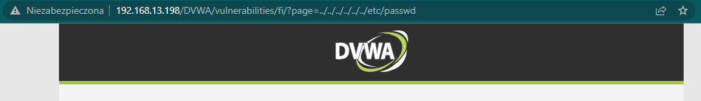
    
        Jak widać zawartość pliku nie wyświetla nam się. Bardzo częstą metodą walidacji inputu jest usuwanie ciągów znaków takich jak: `../` lub `..` lub `//`. Srapwdźmy nasze podejrzenia i zastosujmy następujący **PAYLOAD**:

        ```
        ....//....//....//....//....//....//etc/passwd
        ```

        Efekt był natychmiastowy:

        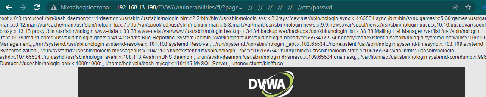

    2. Możemy również spróbować podać bezpośrednią ścieżkę do pliku i zabczyć jaki będzie efekt:
        ```
        /etc/passwd
        ```

        Efekt identyczny jak poprzednio:

        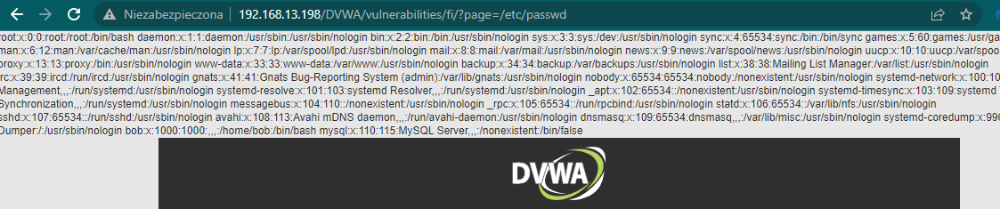


    3. Przybliżę jak wyglądała walidacja inputu na poziomie **medium**. W folderze `DVWA/vulnerabilities/fi/source/` znajduje się plik `medium.php`:
        ```php
        <? php
        
        // The page we wish to display
        $file = $_GET['page'];

        // Input validation
        $file = str_replace( array( "http://", "https://" ),  "", $file );
        $file = str_replace( array( "../", "..\\" ),  "", $file );

        ?>

        ```
        Kod odpowiadający za walidację inputu usuwa następujące ciągi znaków: `../` oraz `..\`. Pierwszy **PAYLOAD** wykorzystywał te funkcję, która zamieniłą nasz ciąg: `....//` na `../`. Z koleji drugi **PAYLOAD** nie posiadał ciągu, który mogłby zostać zmieniony: `/etc/passwd`.

    4. Podobnie jak na poprzednim poziomie zachęcam do napisania **PAYLOADÓW** w celu podejrzenia zawartości pozostałych plików ze ściągawki.

## LFI- High

- Tak samo jak na poprzednich etapach zmieniamy poziom trudności:
    
    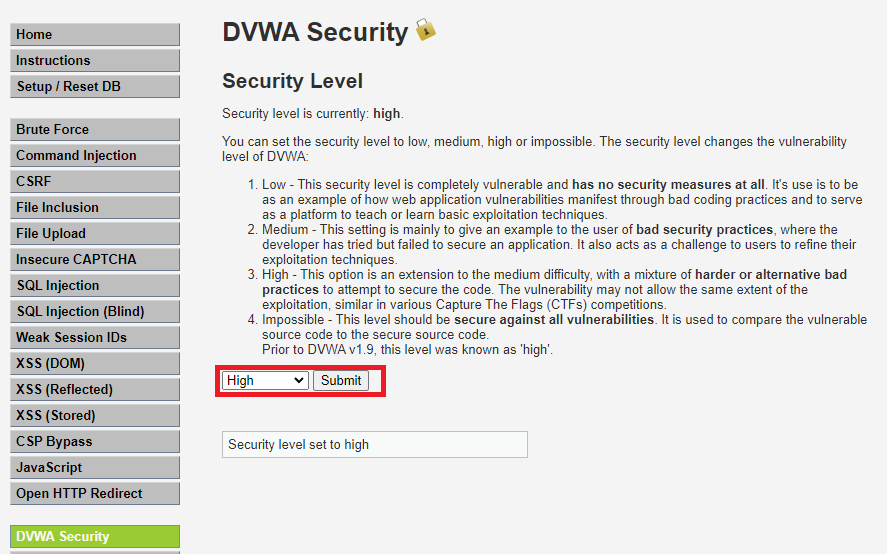


    1. Najpierw zobaczmy jak poradzą sobie **PAYLOADY** z poprzednich etapów. Dostajemy informację zwrotną niezależnie od payloada: 

        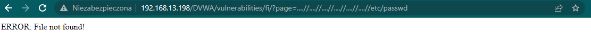

    2. Na tym etapie musimy zobaczyć jak zachowuje się walidacja inputu poprzez metodę prób i błędów. Po n-tym razie wpisałem `file.php` i otrzymałem taki rezultat:

        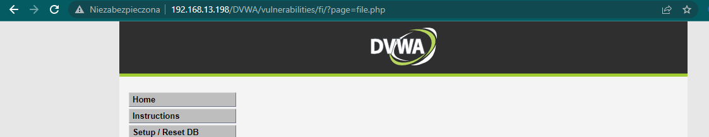

        Oznacza to, że plik, który nie istnieje na serwerze został przepuszczony jako input. Sprawdziłem dla formalności inne rozszerzenie i otrzymałem identyczny rezultat:

        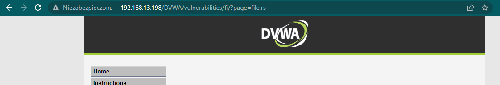

        Z tego wynika, że input akceptuje input zaczynający się od słowa `file`. Na podstawie tej infotmacji możemy stworzyć próbnego **PAYLOADA**.

    3. Jeżeli otwierałaś/eś pliki (np.: `*.pdf`, `*.html`) w przeglądarce to pewnie rozpoznasz ten `schemat URI`:

        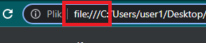

        Na tej podstawie oprzemy naszego **PAYLOADA**:
        ```
        file:///etc/passwd
        ```
    4. Mamy nasz rezultat:

        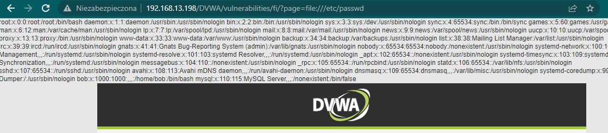

        Tak samo jak poprzednio zalecam spróbować z innymi plikami z chearsheetu.
