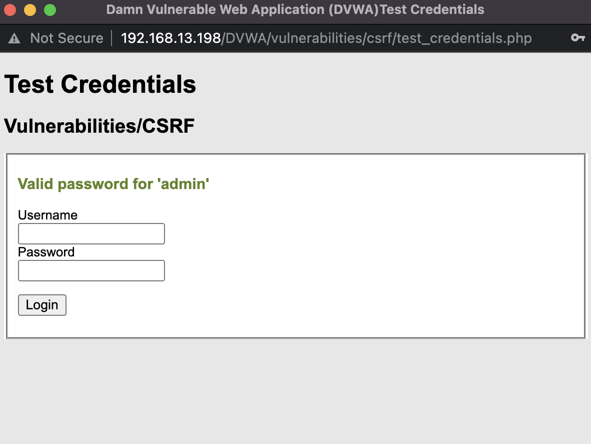

# XSRF (Cross Site Request Forgery)- DVWA Walkhtrough

- autor: [Mateusz Głuchowski](https://github.com/Hue1337)

## Wprowadzenie:
- Atak `XSRF`, nazywany również `CSRF` polega na wykorzystaniu sesji oraz uprawnień użytkownika do wprowadzenia zmian na stronie/ w aplikacji.

- W tym walkthrough przejdziemy 3 poziomy trudności na maszynie podatnej na ten atak: DVWA (Damn Vulnerable Web Application).

## XSRF- Low Security
1. Zaczniemy od kilku bardzo istotnych rzeczy.
    - Upewniamy się, że jesteśmy zalogowani:
        

    - Jeżeli nie jesteśmy, wciskamy przycisk `Logout` i logujemy się za pomocą:
        - Login: `admin`
        - Password: `password`

        

    - Jeszcze zmienimy poziom trudności na łatwy:
        

    - Na koniec przechodzimy do zakładki `CSRF`:
        

3. Następnie zobaczmy na czym stoimy. 

    - Strona umożliwia nam zmiane hasła dla obecnie zalogowanego użytkownika. W tym przypadku odpalamy `Burp Suite` i przechwytujemy requesta ze zmiany hasła:

        

        Wykorzystamy zapytanie `GET` jakie zostaje wysłane do `backendu` aplikacji:

        ```
        http://192.168.X.X/DVWA/vulnerabilities/csrf/?password_new=haslo&password_conf=haslo&Change=Change
        ```

        `Url` zawiera parametry `password_new` oraz `password_conf`, pod których wartości podstawiamy nowe hasło. Przykładowo `haslo`.

        A następnie z naszego **PAYLOADA**. Ustawiamy link w przekierowaniu na powyższy:

        

        Odpalamy lokalny serwer w folderze z pobranym **PAYLOADEM**:

        ```py
        python3 -m http.server
        ```

        I przechodzimy w przeglądarce do `localhosta`:
        
        ```
        http://127.0.0.1:8000/paylaod1.html
        ```

        

        Korzystamy z *instrukcji* i mamy zmienione hasło:
        
        

        Weryfikujemy nowe hasło (na nowo zmienione) i nazwe użytkownika:

        

        Tym oto sposobem zdobywamy **flage**.

## XSRF- Medium Security

- Zaczynamy od zmiany poziomu trudności na `Medium`. Następnie powtarzamy kroki z poprzedniego poziomu trudności. Po przechwyceniu `requesta` widzimy takie informacje:

    

    Szczególnie interesuje nas `linia 6`:
    
        ```
        Referer: http://192.168.1.44/DVWA/vulnerabilities/csrf/
        ```